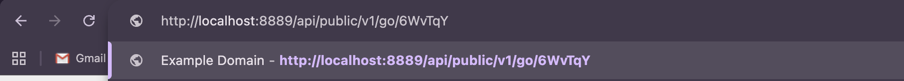
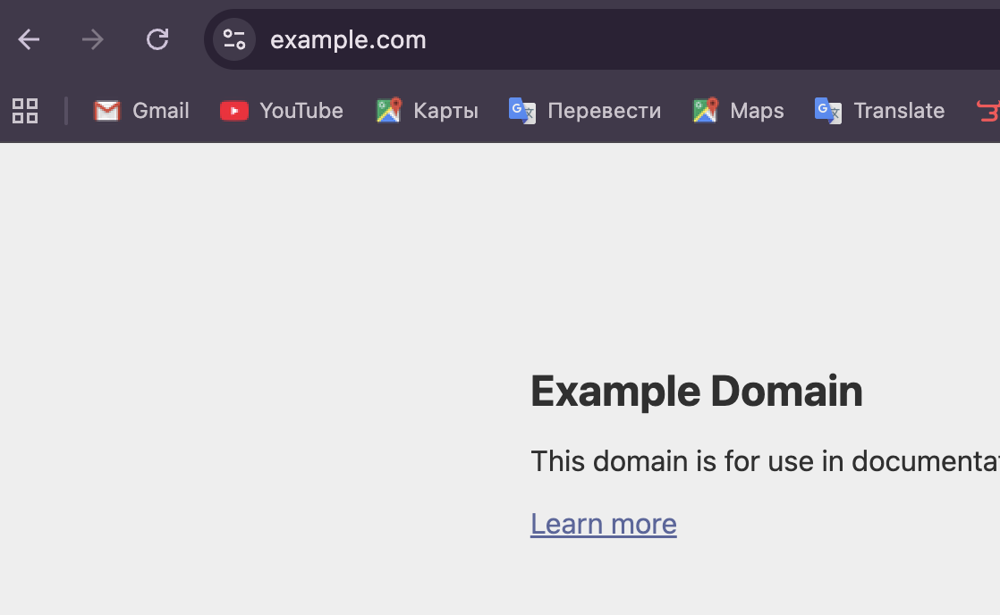
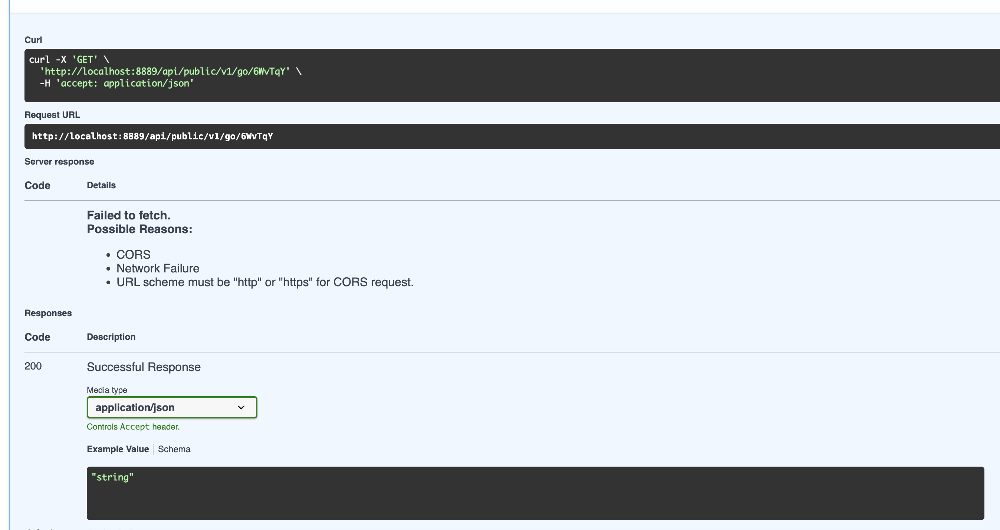
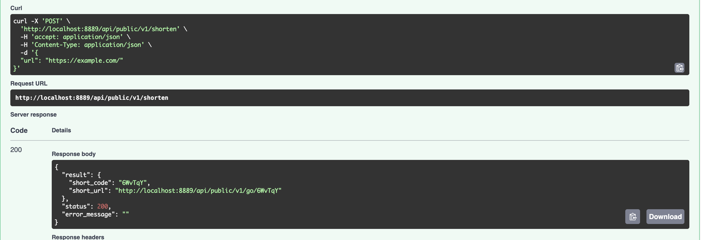
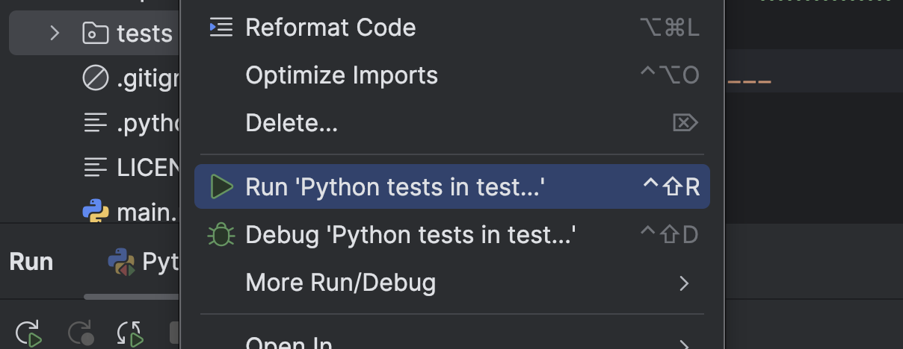
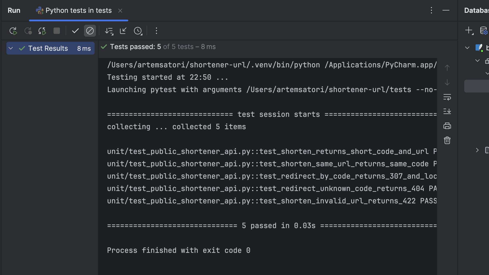

# shortener-url
Тестовое задание для Boto Education

___

# Цель: Сервис для сокращения ссылок и редирект по сокращенной ссылке
___

## Стек:
### - Python 3.12
### - FastAPI
### - SQLite3
### - Pytest
### - Orjson

___

## Локальный запуск
### 1) Установить необходимые зависимости
#### Я использую пакетный менеджер uv, но можно использовать стандартный pip

### Через `uv`
`uv sync --no-cache`

### Через `pip`
`pip install -r requerements.txt`

### 2) Запустить команду `make run-local` или `python main.py app`

___

## Онбординг API
### Документация доступна по адресу http://localhost:8889/api/public/docs
### Доступные API:


#### GET /api/v1/public/go/{code}
#### Description: Редирект по короткому коду, если такой есть
#### Response Example:
```json
{
  "result": {},
  "status": 307,
  "error_message": ""
}
```




#### ВАЖНО! Не пытаться редиректнуться через Swager UI, свагер не даст вам такое сделать, тестить либо через браузер или Postman


___

#### POST /api/v1/public/shorten
#### Description: Создать ссылку
#### Request Example:
```json
{
  "url": "https://example.com/"
}
```
#### Response Example:
#### short_url - для тестов, нужно вставить в браузер и тогда будет редирект
#### short_code - короткий код для редиректа
```json
{
  "result": {
    "short_code": "6WvTqY",
    "short_url": "http://localhost:8889/api/public/v1/go/6WvTqY"
  },
  "status": 200,
  "error_message": ""
}
```


___

### Тесты:
#### Запуск тестов можно по кнопочке в IDE или командой `pytest tests`


